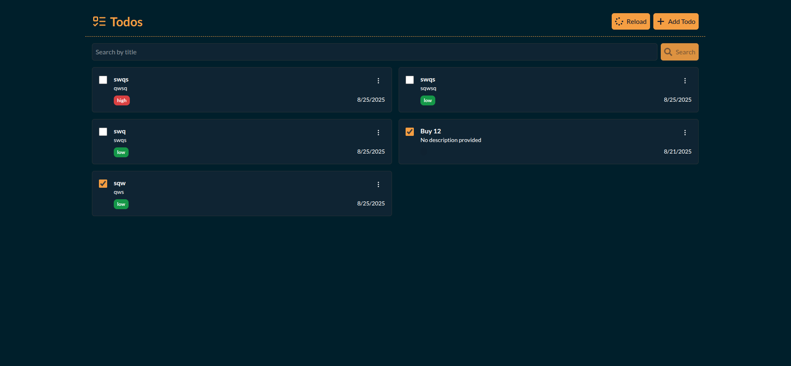

# Todo App

A full-stack Todo application built with React (Frontend) and Express.js (Backend) with PostgreSQL database.

## Features

- ✅ Create, Read, Update, Delete todos
- ✅ Mark todos as completed
- ✅ Priority levels (Low, Medium, High)
- ✅ Search todos by title
- ✅ Responsive design with Tailwind CSS
- ✅ Real-time updates

## Tech Stack

### Backend
- **Node.js** - Runtime environment
- **Express.js** - Web framework
- **PostgreSQL** - Database
- **Sequelize** - ORM
- **CORS** - Cross-origin resource sharing

### Frontend
- **React 19** - UI library
- **Vite** - Build tool
- **Tailwind CSS** - Styling
- **Axios** - HTTP client
- **React Icons** - Icon library

## Prerequisites

Before running this application, make sure you have the following installed:

- **Node.js** (v18 or higher)
- **PostgreSQL** (v12 or higher)
- **npm** or **pnpm** (package manager)

## Installation & Setup

### Quick Start (Recommended)

```bash
git clone <repository-url>
cd todo_app
chmod +x setup.sh
./setup.sh
```

### Manual Setup

### 1. Clone the Repository

```bash
git clone <repository-url>
cd todo_app
```

### 2. Backend Setup

#### Navigate to backend directory
```bash
cd backend
```

#### Install dependencies
```bash
npm install
# or
pnpm install
```

#### Database Setup

1. **Create PostgreSQL Database**
   ```sql
   CREATE DATABASE todo_app;
   ```

   **Note:** Tables will be automatically created when you start the backend server. Sequelize ORM handles table creation based on the model definitions.

2. **Create Environment File**
   Create a `.env` file in the `backend` directory:
   ```env
   PORT=5000
   DB_NAME=todo_app
   DB_USER=your_postgres_username
   DB_PASS=your_postgres_password
   DB_HOST=localhost
   DB_DIALECT=postgres
   ```

   **Note**: Replace `your_postgres_username` and `your_postgres_password` with your actual PostgreSQL credentials.

#### Start the Backend Server
```bash
# Development mode (with auto-reload)
npm run dev

# Production mode
npm start
```

The backend server will start on `http://localhost:5000`

### 3. Frontend Setup

#### Navigate to frontend directory
```bash
cd ../frontend
```

#### Install dependencies
```bash
npm install
# or
pnpm install
```

#### Start the Frontend Development Server
```bash
npm run dev
```

The frontend application will start on `http://localhost:5173`

## API Endpoints

### Todos
- `GET /todos` - Get all todos
- `GET /todos/:id` - Get todo by ID
- `POST /todos` - Create new todo
- `PUT /todos/:id` - Update todo
- `DELETE /todos/:id` - Delete todo

### Request/Response Examples

#### Create Todo
```bash
POST /todos
Content-Type: application/json

{
  "title": "Complete project",
  "description": "Finish the todo app project",
  "priority": "high"
}
```

#### Update Todo
```bash
PUT /todos/1
Content-Type: application/json

{
  "title": "Updated title",
  "description": "Updated description",
  "priority": "medium",
  "completed": true
}
```

## Project Structure

```
todo_app/
├── backend/
│   ├── app/
│   │   ├── config/
│   │   │   └── db.js          # Database configuration
│   │   ├── controllers/
│   │   │   └── todo.controller.js  # Todo CRUD operations
│   │   ├── models/
│   │   │   └── todo.model.js       # Todo model definition
│   │   └── routes/
│   │       └── todo.route.js       # Todo routes
│   ├── index.js                     # Server entry point
│   └── package.json
├── frontend/
│   ├── src/
│   │   ├── components/
│   │   │   ├── AddTodo.jsx          # Add/Edit todo form
│   │   │   ├── CustomDropdown.jsx   # Priority dropdown
│   │   │   ├── Filters.jsx          # Search functionality
│   │   │   ├── TodoItem.jsx         # Individual todo item
│   │   │   └── index.js             # Component exports
│   │   ├── App.jsx                  # Main application component
│   │   ├── main.jsx                 # React entry point
│   │   └── index.css                # Global styles
│   ├── index.html
│   └── package.json
└── README.md
```

## Database Schema

### Todo Table
```sql
CREATE TABLE "Todos" (
  "id" SERIAL PRIMARY KEY,
  "title" VARCHAR(255) NOT NULL,
  "description" TEXT NOT NULL,
  "priority" VARCHAR(255),
  "completed" BOOLEAN DEFAULT false,
  "createdAt" TIMESTAMP NOT NULL DEFAULT NOW(),
  "updatedAt" TIMESTAMP NOT NULL DEFAULT NOW()
);
```

## Available Scripts

### Backend
- `npm start` - Start production server
- `npm run dev` - Start development server with nodemon

### Frontend
- `npm run dev` - Start development server
- `npm run build` - Build for production
- `npm run preview` - Preview production build
- `npm run lint` - Run ESLint

## Troubleshooting

### Common Issues

1. **Database Connection Error**
   - Ensure PostgreSQL is running
   - Verify database credentials in `.env` file
   - Check if database exists

2. **Port Already in Use**
   - Change PORT in `.env` file
   - Kill process using the port: `lsof -ti:5000 | xargs kill -9`

3. **CORS Error**
   - Ensure backend is running on correct port
   - Check if frontend URL is allowed in CORS configuration

4. **Module Not Found**
   - Run `npm install` in both backend and frontend directories
   - Clear node_modules and reinstall: `rm -rf node_modules && npm install`

## Contributing

1. Fork the repository
2. Create a feature branch: `git checkout -b feature-name`
3. Commit changes: `git commit -m 'Add feature'`
4. Push to branch: `git push origin feature-name`
5. Submit a pull request

## License

This project is licensed under the ISC License.

